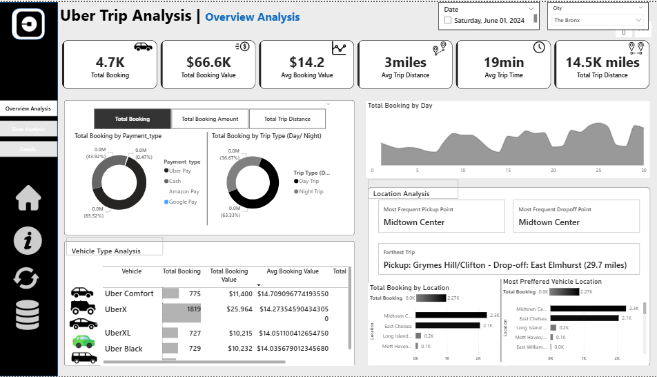
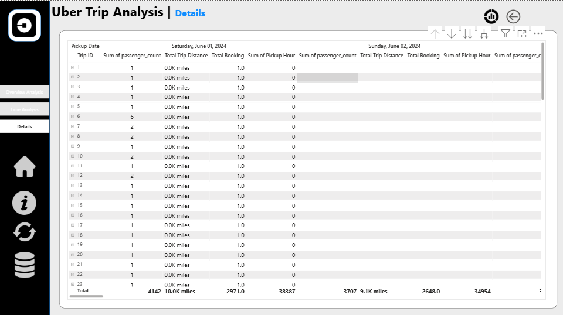

# 📊 Uber Trip Analysis Dashboard

This project provides a detailed analysis of Uber trips using interactive dashboards. The dashboards are built to help understand booking patterns, payment trends, location insights, and time-based analysis.

## 🔹 Dashboards Overview
1. Overview Analysis Dashboard

Key Metrics:

Total Bookings: 4.7K

Total Booking Value: $66.6K

Average Booking Value: $14.2

Average Trip Distance: 3 miles

Average Trip Time: 19 min

Total Trip Distance: 14.5K miles

Insights Covered:

Bookings by Payment Type (Uber Pay, Cash, Google Pay, Amazon Pay)

Trip Type Distribution (Day vs Night trips)

Bookings Trend by Day of Month

Location Analysis (Most Frequent Pickup & Drop-off → Midtown Center)

Farthest Trip (Pickup: Grymes Hill/Clifton → Drop-off: East Elmhurst, 29.7 miles)

Vehicle Type Analysis (UberX, Uber Comfort, UberXL, Uber Black)

Most Preferred Pickup Locations

2. Time Analysis Dashboard

Key Metrics:

Total Bookings: 179

Total Booking Value: $5K

Average Booking Value: $28

Average Trip Distance: 8 miles

Average Trip Time: 23 min

Total Trip Distance: 1.4K miles

Insights Covered:

Booking distribution by Pickup Time (hourly trends)

Booking distribution by Day of Week

Heatmap of Bookings by Hour & Day (to identify peak demand hours)

3. Details Dashboard

Trip-wise Detailed Data Table:

Trip ID

Passenger Count

Total Trip Distance

Total Booking Amount

Pickup Hour

Pickup Date

Daily Aggregated Totals:

Passenger Count

Total Trip Distance

Total Bookings

Total Pickup Hours

This sheet acts as the raw data explorer to drill down into each trip’s details.

## 🔹 Tech Stack

Tool Used: Power BI / Tableau (adjust as per your project)

Data Source: Uber Trips Dataset

Features:

Interactive Filters (Date, City)

Drill-down Analysis (Overview → Time → Details)

Data Visualizations (Bar Charts, Donut Charts, Heatmaps, Line Charts, Tables)

## 🔹 Key Learnings

Analyzed customer booking behavior based on time, distance, and location.

Identified most profitable vehicle types and preferred payment modes.

Discovered peak demand hours and popular pickup-drop locations.

Built a data-driven decision support system for improving Uber’s services.

## 📌 How to Use

Open the dashboard in Power BI/Tableau.

Use filters to analyze data by Date and City.

Navigate through the three dashboards:

Overview Analysis → Business Summary

Time Analysis → Time-based Trends

# 📊 Uber Trip Analysis Dashboard

This project provides analysis of Uber trips using interactive dashboards.  

---

## 📌 Dashboards

### 1. Overview Analysis

### 2. Time Analysis

### 3. Details

